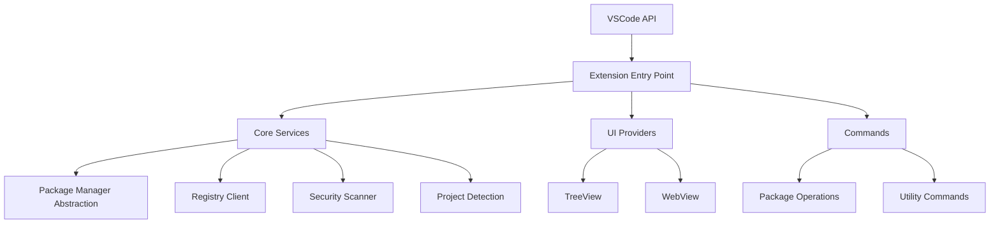
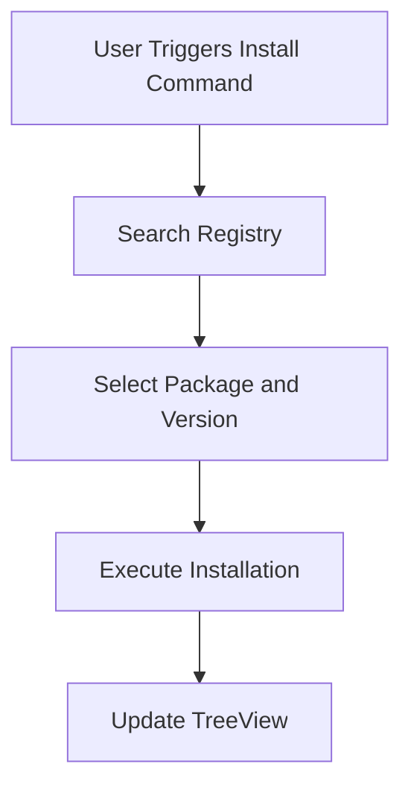
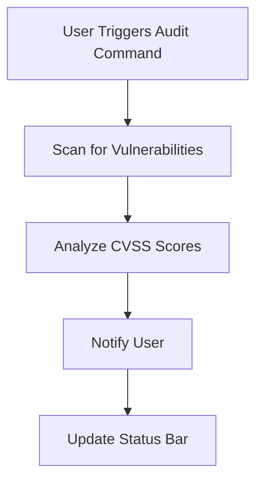

# Appendices

This section includes supplementary materials, diagrams, glossaries, and external references to provide additional context and resources for the VSCode NPM Package Manager Extension.

## Glossary

### Terms and Definitions

- **Node.js**: A JavaScript runtime built on Chrome's V8 JavaScript engine, used for server-side and networking applications.
- **Package Manager**: A tool that automates the process of installing, upgrading, configuring, and removing software packages.
- **Dependency**: A piece of software that another piece of software relies on to function correctly.
- **Registry**: A database of packages that can be installed via a package manager (e.g., npm registry).
- **Lockfile**: A file that records the exact versions of dependencies installed in a project to ensure consistency across installations.
- **CVSS**: Common Vulnerability Scoring System, a standardized method for rating the severity of security vulnerabilities.
- **Multi-root Workspace**: A VSCode feature that allows multiple project folders to be opened and managed simultaneously.
- **WebView**: A VSCode UI component that renders HTML content within the editor.
- **TreeView**: A VSCode UI component that displays hierarchical data in a tree structure.

## Diagrams

### System Architecture Diagram

Below is a high-level overview of the extension's architecture:



### Workflow Diagrams

#### Package Installation Workflow



#### Security Audit Workflow



## External References

### Documentation

- [VSCode Extension API](https://code.visualstudio.com/api): Official documentation for developing VSCode extensions.
- [npm Documentation](https://docs.npmjs.com/): Comprehensive guide to using npm.
- [Yarn Documentation](https://yarnpkg.com/getting-started): Official Yarn documentation.
- [pnpm Documentation](https://pnpm.io/motivation): Guide to using pnpm.
- [Bun Documentation](https://bun.sh/docs): Official Bun documentation.

### Tools and Libraries

- [TypeScript](https://www.typescriptlang.org/): Official TypeScript documentation.
- [ESLint](https://eslint.org/): Documentation for ESLint, the pluggable linting utility.
- [Prettier](https://prettier.io/): Documentation for Prettier, the opinionated code formatter.
- [Jest](https://jestjs.io/): Documentation for Jest, the testing framework.

### Security

- [CVSS Calculator](https://www.first.org/cvss/calculator): Tool for calculating CVSS scores for vulnerabilities.
- [Snyk](https://snyk.io/): Platform for finding and fixing vulnerabilities in dependencies.
- [Dependabot](https://dependabot.com/): Automated dependency updates for GitHub repositories.

### Community

- [VSCode GitHub Repository](https://github.com/microsoft/vscode): Official repository for VSCode.
- [npm Community Discussions](https://github.com/npm/cli/discussions): Discussions and support for npm.
- [Yarn Community](https://github.com/yarnpkg/berry/discussions): Community discussions for Yarn.

## Configuration Examples

### Workspace Settings

To configure the extension for a specific workspace, add the following to your `.vscode/settings.json`:

```json
{
  "npmPackageManager.defaultPackageManager": "yarn",
  "npmPackageManager.updateCheckInterval": 30,
  "npmPackageManager.showSecurityNotifications": true
}
```

### Project-Specific Settings

To override settings for a specific project, add a `npmPackageManager` section to your workspace or folder settings:

```json
{
  "npmPackageManager.defaultPackageManager": "pnpm",
  "npmPackageManager.updateCheckInterval": 60
}
```

## Troubleshooting

### Common Issues

#### Extension Not Detecting Project

- **Cause**: The project does not have a valid `package.json` file in the root directory.
- **Solution**: Ensure your project has a valid `package.json` file.

#### Package Manager Not Found

- **Cause**: The selected package manager is not installed globally or in the project.
- **Solution**: Install the package manager globally or locally in your project.

#### Slow Performance

- **Cause**: Frequent update checks or large dependency trees.
- **Solution**: Increase the update check interval or disable auto-updates.

#### Lockfile Issues

- **Cause**: Conflicts or corruption in lockfiles.
- **Solution**: The extension automatically detects and handles lockfile conflicts. If issues persist, manually resolve conflicts or regenerate the lockfile.

### Debugging

#### Dev Tools

- Open Dev Tools (`Ctrl+Shift+I`) to inspect errors and debug issues.

#### Output Panel

- Check the Output panel in VSCode for extension logs and debugging information.

#### Disable Other Extensions

- Temporarily disable other extensions to rule out conflicts and isolate issues.

## Contributing

### How to Contribute

- **Fork the Repository**: Fork the project repository to your GitHub account.
- **Clone Your Fork**: Clone the repository and set up the development environment.
- **Create a Branch**: Create a feature branch for your changes.
- **Make Changes**: Implement your changes, write tests, and update documentation.
- **Submit a Pull Request**: Open a pull request to the `main` branch.

### Code of Conduct

- **Respect**: Be respectful and considerate of others' opinions and contributions.
- **Collaboration**: Work collaboratively to achieve the best outcomes.
- **Feedback**: Provide constructive feedback and be open to receiving it.

## License

This project is licensed under the MIT License. See the [LICENSE](LICENSE) file for more information.

## Support

### Getting Help

- **GitHub Issues**: Open an issue on the [GitHub repository](https://github.com/involvex/vscode-npm-package-manager/issues) for bugs, feature requests, or questions.
- **Discord Community**: Join the community discussion on [Discord](https://discord.gg/involvex) for real-time support and discussions.
- **Email Support**: Contact the team via [email](mailto:support@involvex.dev) for direct assistance.

### Reporting Bugs

- **Check Existing Issues**: Search the GitHub Issues to ensure the bug hasn't been reported already.
- **Provide Details**: Include steps to reproduce the bug, expected behavior, and actual behavior.
- **Attach Logs**: Attach relevant logs or screenshots to help diagnose the issue.

### Requesting Features

- **Describe the Feature**: Provide a clear and detailed description of the feature.
- **Explain the Use Case**: Describe how the feature will benefit users and align with project goals.
- **Prioritize**: Indicate the priority or urgency of the feature.

## Conclusion

The appendices provide additional resources, examples, and references to support the development, usage, and contribution to the VSCode NPM Package Manager Extension. Whether you're a user, developer, or contributor, these materials offer valuable insights and tools to enhance your experience with the extension.
